# PÁGINA WEB PARA VIDEOS ADMINISTRABLE CON PHP Y MYSQL

Página web de videos, el sistema es administrable está desarrollao en la arquitectura MVC


## Feartures

- Agregar productos a la venta, a traves de codigo de barras
- Modulo de usuario
- Modulo de categorias A
- Modulo de categorias B
- Modulo de video
- Modulo de anuncio


## Instalación

Puedes seguir estos pasos para la instalación:

* Clonar desde github (usar github desktop)
```bash
  git clone https://github.com/yorchavez9/pagina-web-de-videos-.git
```
* El archivos descargado tiene que estar en c/xammp/htdoc/{nombre-del-archivo}

* Importar la base de datos en el navgador "http://localhost/phpmyadmin/"
```bash
  db.video.sql
```


## Variables de entorno

Para ejecutar este proyecto, Necesitarás añadir las siguientes configuraciones en la Conexion que está ubicando 
en modelos/conexion.php

`
<?php
class Conexion{
    static public function conectar(){
        $link = new PDO("mysql:host=localhost;dbname=sis_apuuray","root","");
        return $link;
    }
}
?>
`

Por ültimo ejecutar el proyecto en "http://localhost/{Nombre del archivo o proyecto}"


## Screenshots

#### Inico de la página

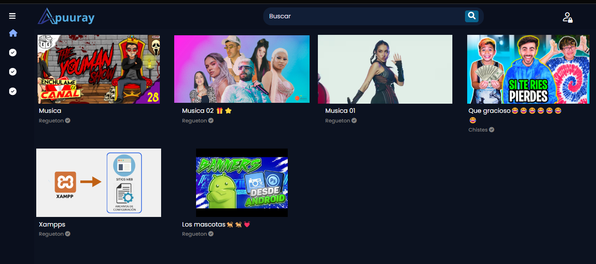

#### Reproducción de video

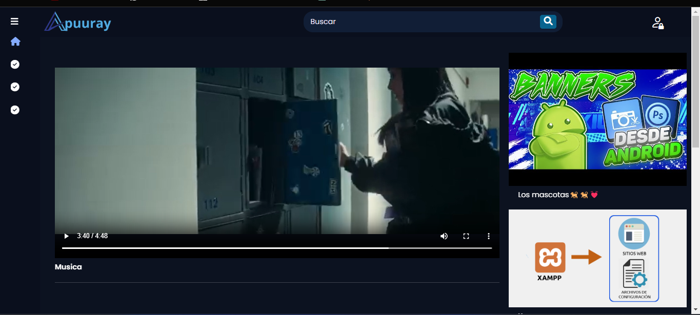


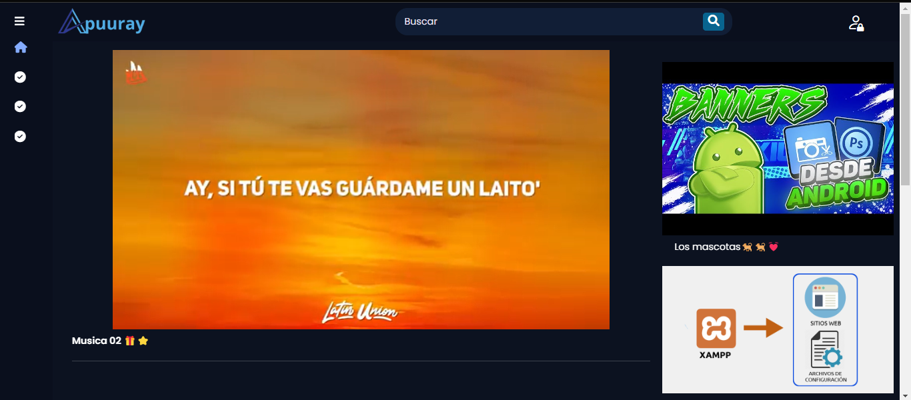

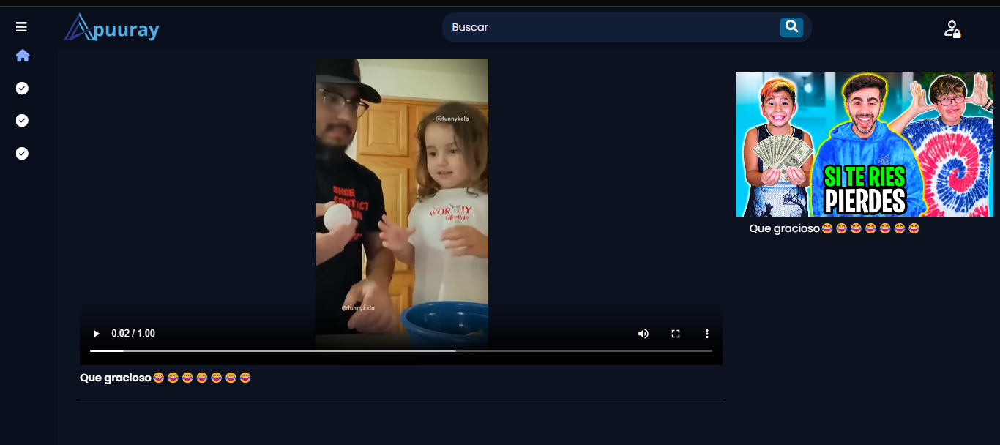

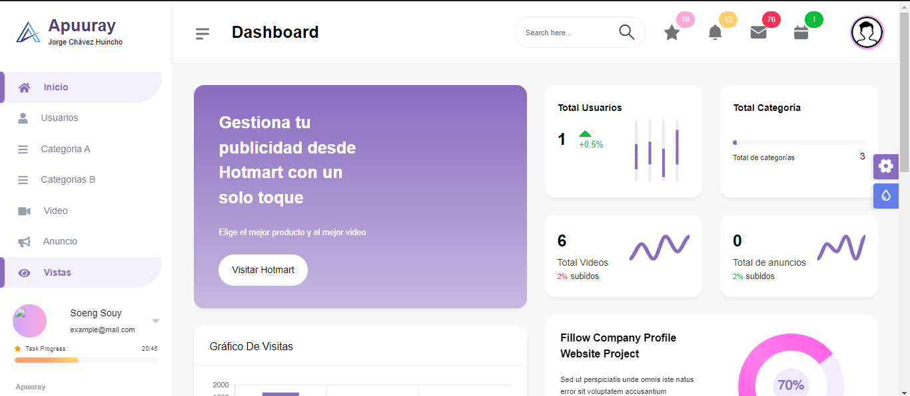

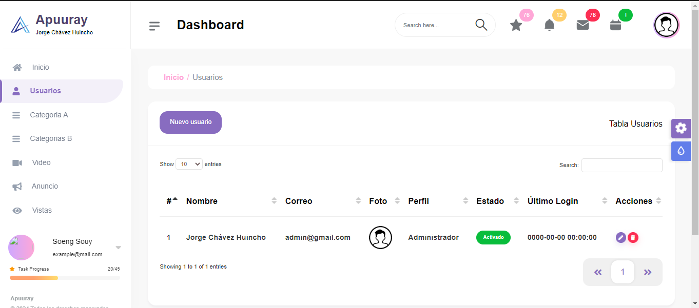

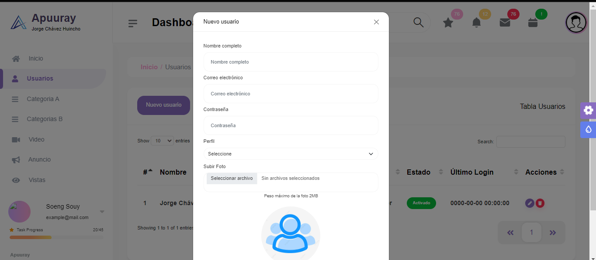

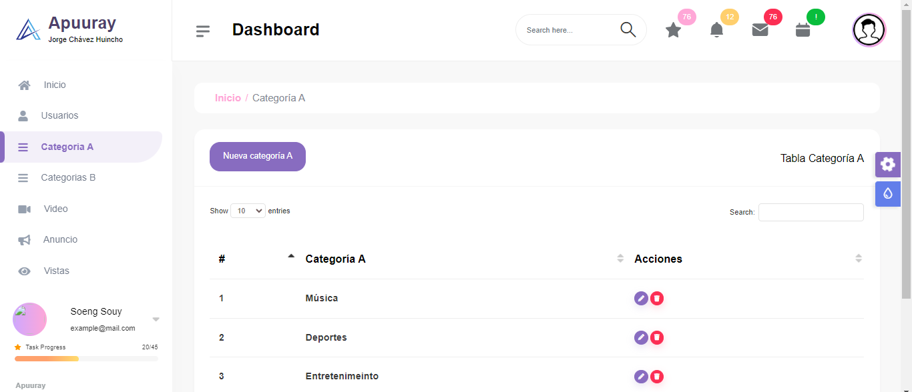

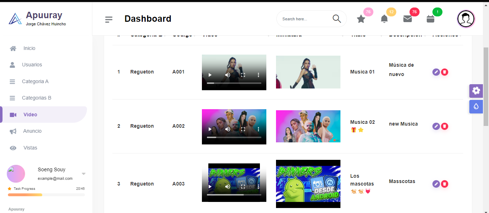

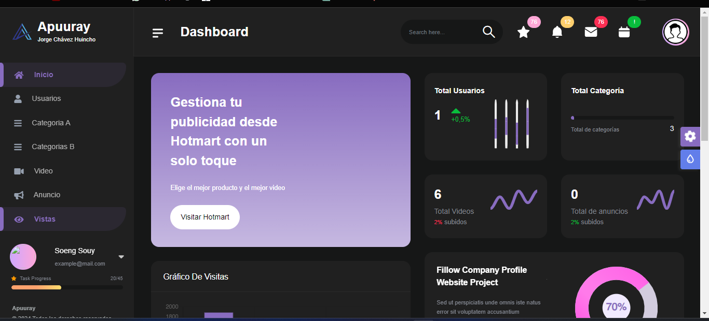

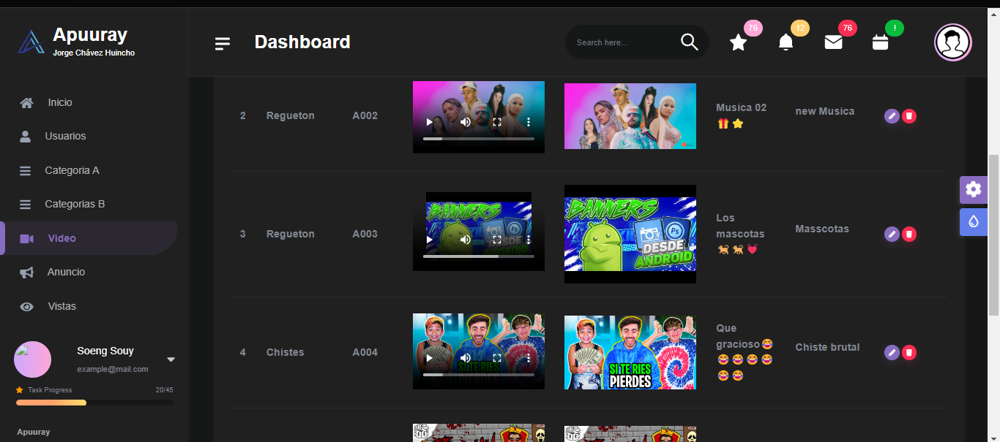


## Feedback

Si tienes alguna duda, por favor hazme saber djjmygm160399@gmail.com o al whatsapp: +51 920 468 502